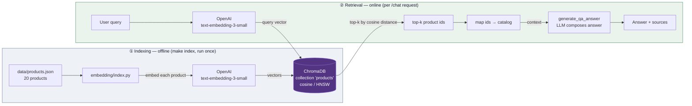
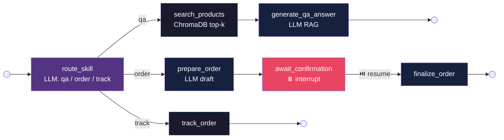
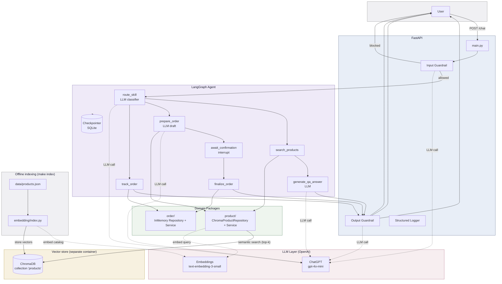
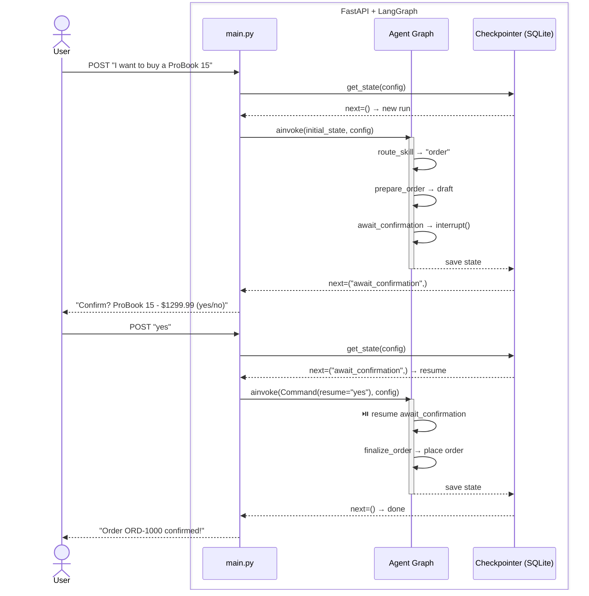

# E-commerce AI Agent - Agentic RAG + HITL

A **multi-skill AI agent** built with **FastAPI**, **LangGraph**, **OpenAI ChatGPT**, and **ChromaDB**. The agent routes each request to the right skill - Q&A (RAG), Order (HITL), or Track - and orchestrates the full conversation flow. 7 nodes, 3 skills, 1 checkpointer, ChromaDB-backed semantic retrieval.

## Skills

Each **skill** is a dedicated path through the LangGraph state graph. An LLM classifier picks the right one on every request:

| Skill | Trigger | What happens |
|-------|---------|-------------|
| **Q&A (RAG)** | "Tell me about laptops" | Classify → search catalog → LLM composes answer from results |
| **Order (HITL)** | "I want to buy a ProBook 15" | LLM extracts product → draft → interrupt → confirm → place |
| **Track** | "Where is my order?" | Look up order registry by session → return status + ETA |

Adding a new skill means adding one node + one edge - zero changes to existing skills.

Every request passes through **input and output guardrails** (LLM-based validation) before reaching the agent and before returning to the user.

## Architecture highlights

- **Multi-skill agent** - LLM-powered skill router classifies intent, conditional edges route to the right skill path
- **Agentic RAG** - the agent decides when to run semantic retrieval (not every request goes through the vector store)
- **Real RAG with ChromaDB** - offline indexing (embed the catalog once) + online retrieval (embed the query, top-k by cosine distance); vectors live in a separate ChromaDB container
- **Human-in-the-Loop** - orders require explicit user confirmation via LangGraph's native `interrupt()` / `Command(resume=...)` pattern
- **Persistent state** - graph execution state survives server restarts (SQLite checkpointer)
- **Package-by-feature** - `product/` and `order/` domains each own their repository (ABC interface — ChromaDB for products, in-memory for orders) and service layer
- **Structured logging** - per-request timing breakdown: guardrail latency, graph execution time, total request duration; retrieval logs top-k hits with cosine distances

## RAG pipeline (index + retrieval)

Two separate phases share the same ChromaDB collection and the same embedding model. **Indexing** is an offline batch job (`make index`); **retrieval** runs online per request. Embeddings are computed client-side — the ChromaDB server only stores and compares vectors.



## Agent graph (7 nodes, 3 paths)



## Architecture



## HITL flow (LangGraph interrupt / resume)



## Project structure

```
app/
├── agent/          # LangGraph graph (AgentGraph), skills (AgentSkills), state
├── config/         # DI wiring — module-level singletons (di.py)
├── product/        # ProductRepository (ABC + ChromaDB) + ProductService + catalog loader
├── order/          # OrderRepository (ABC + InMemory) + OrderService
├── llm/            # LlmClient, prompts, guardrail, skill router, response generators
├── main.py         # FastAPI entry point + lifespan
├── models.py       # Pydantic request/response
└── logger.py       # Structured logging with timing
embedding/
├── index.py        # Offline RAG indexer — embeds the catalog into ChromaDB (`make index`)
└── inspect.py      # Inspect stored vectors/docs (`make inspect-documents` / `inspect-embeddings`)
data/
├── products.json   # Canonical product catalog (system of record, 20 products)
└── checkpoints.db  # SQLite checkpointer (gitignored, mounted in Docker)
tests/
├── test_main.py    # 10 integration tests (HTTP + mocked LLM and vector search)
├── test_product.py # 9 unit tests (catalog loader + ChromaDB repo with mocked collection)
└── test_order.py   # 8 unit tests
```

## Stack

| Component | Technology |
|-----------|-----------|
| API framework | FastAPI (async) |
| Agent orchestration | LangGraph (state graph with 7 nodes, 3 conditional paths) |
| LLM | OpenAI ChatGPT gpt-4o-mini (via langchain-openai) |
| RAG retrieval | ChromaDB 1.5.9 (separate container) + OpenAI embeddings (text-embedding-3-small) |
| Data validation | Pydantic |
| State persistence | LangGraph SQLite checkpointer (+ InMemorySaver for tests) |
| Linting & formatting | ruff |
| Containerization | Docker + docker-compose |
| Package management | uv |

## Quick start

```bash
# 1. Set your API key
cp .env.example .env   # edit with your OPENAI_API_KEY

# 2. Build and run (app on :8000, ChromaDB on :8001)
make build
make up                # starts app + chroma with hot reload

# 3. Build the vector index — embeds the catalog into ChromaDB (run once)
make index             # re-run whenever data/products.json changes

# 4. Test it
# Open api-requests.http in PyCharm/IntelliJ, select "dev" environment,
# and click the green ▶ next to each request.
```

> **Note:** Q&A requires the index. If you skip `make index`, product search has
> no collection to query. The indexer is a one-off batch job, kept out of the
> request path so startup stays fast and embeddings are computed exactly once.

API: `http://localhost:8000` | Swagger: `http://localhost:8000/docs`

## Commands

```
make up                 start app + chroma with hot reload
make index              build the vector index (embed catalog into ChromaDB)
make inspect-documents  list stored docs + metadata in ChromaDB
make inspect-embeddings same, plus a preview of each stored vector
make down               stop services
make logs               tail logs
make test               run tests locally
make lint               ruff check
make format             ruff format
make build              rebuild Docker image
```

## Skill router evaluation

The skill router is LLM-powered, so accuracy is measured with a frozen test set.

```bash
make eval   # runs evaluation/skill_router.eval.py — hits real OpenAI API
```

**Results (gpt-4o-mini, 56 test cases):**

| Skill | Cases | Correct | Accuracy |
|-------|-------|---------|----------|
| Q&A   | 17    | 17      | 100%     |
| Order | 26    | 20      | 76.9%    |
| Track | 13    | 13      | 100%     |
| **Total** | **56** | **50** | **88.89%** |

**Main failure pattern — Order → Track (6 cases):**

The router misclassifies order-management intent as tracking when the message contains order-status vocabulary:

```
"I want to cancel my order"                        expected=order  got=track
"I want to return my order"                        expected=order  got=track
"Return the headphones I bought"                   expected=order  got=track
"I want to cancel order #123"                      expected=order  got=track
"I want to return the item, what is the status?"   expected=order  got=track
"I am not happy with my order, I want a refund"    expected=order  got=track
```

Root cause: the prompt doesn't explicitly distinguish *managing* an order (cancel, return, refund) from *tracking* it (status, ETA, location). A prompt update or few-shot examples would fix this.

## API

```bash
# Product Q&A
curl -X POST http://localhost:8000/chat \
  -H "Content-Type: application/json" \
  -d '{"message": "Tell me about laptops", "session_id": "s1"}'

# Place an order (step 1 - draft)
curl -X POST http://localhost:8000/chat \
  -H "Content-Type: application/json" \
  -d '{"message": "I want to buy a ProBook 15", "session_id": "s2"}'

# Confirm order (step 2)
curl -X POST http://localhost:8000/chat \
  -H "Content-Type: application/json" \
  -d '{"message": "yes", "session_id": "s2"}'

# Track order
curl -X POST http://localhost:8000/chat \
  -H "Content-Type: application/json" \
  -d '{"message": "Where is my order?", "session_id": "s2"}'
```

Or use `api-requests.http` with IntelliJ HTTP Client or `npx httpyac api-requests.http --env dev`.
