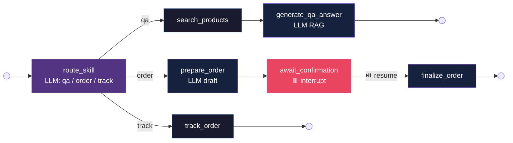
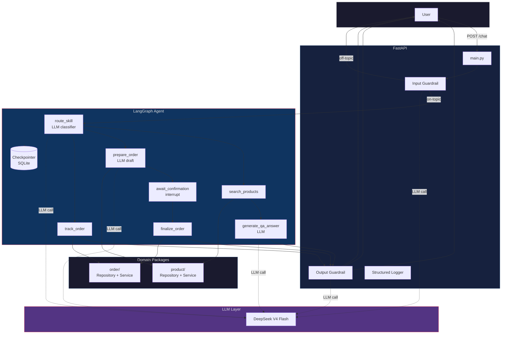
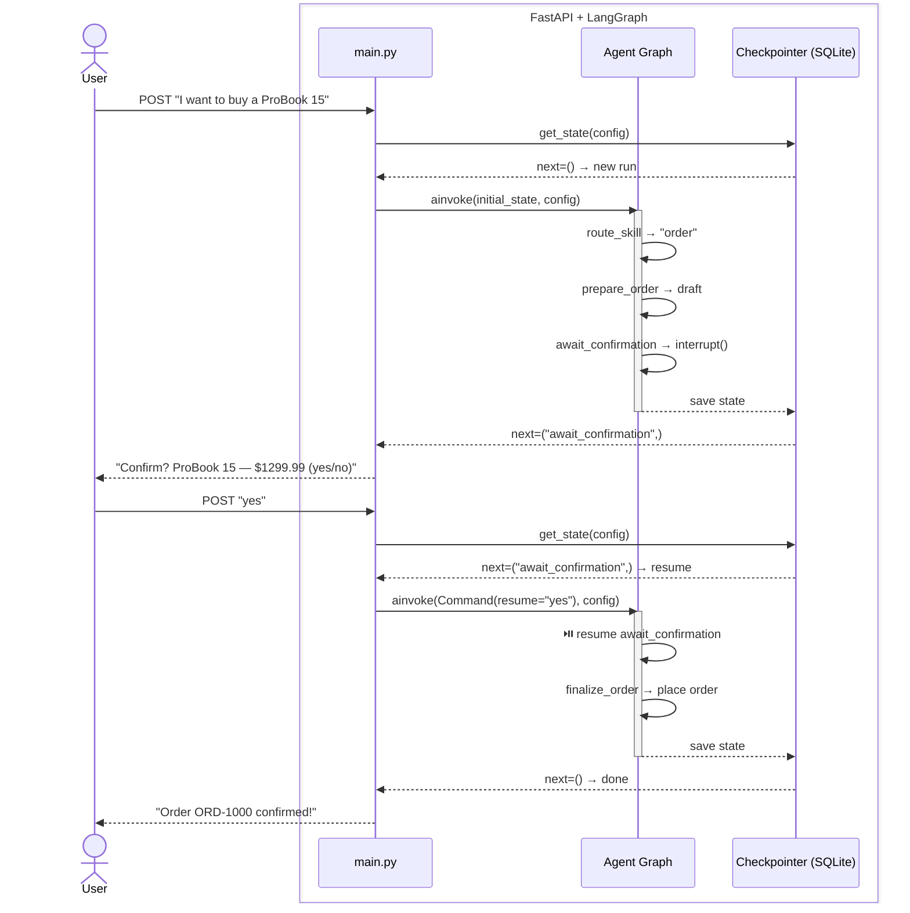

# E-commerce AI Agent — Agentic RAG + HITL

An **agentic RAG** shopping assistant built with **FastAPI**, **LangGraph**, and **DeepSeek LLM** — the agent decides when to search, when to ask for confirmation, and when to look up orders. 7 nodes, 3 skills, 1 checkpointer.

## What it does

The agent handles three types of customer interactions, each routed dynamically by an LLM classifier:

| Skill | Trigger | Flow |
|-------|---------|------|
| **Q&A** | "Tell me about laptops" | Classify intent → search product catalog → LLM composes answer from results (RAG) |
| **Order** | "I want to buy a ProBook 15" | LLM extracts product + quantity → generates draft → asks for confirmation → places or cancels |
| **Track** | "Where is my order?" | Looks up order registry by session → returns status and ETA |

Every request passes through **input and output guardrails** (LLM-based validation) before reaching the agent and before returning to the user.

## Architecture highlights

- **Agentic RAG** — the agent decides when to search the product catalog
- **Human-in-the-Loop** — orders require explicit user confirmation via LangGraph's native `interrupt()` / `Command(resume=...)` pattern
- **Persistent state** — graph execution state survives server restarts (SQLite checkpointer)
- **Package-by-feature** — `product/` and `order/` domains each own their repository (ABC interface + in-memory implementation) and service layer
- **Structured logging** — per-request timing breakdown: guardrail latency, graph execution time, total request duration

## Agent graph (7 nodes, 3 paths)



## Architecture



## HITL flow (LangGraph interrupt / resume)



## Project structure

```
app/
├── agent/          # LangGraph graph, skills, state
├── product/        # ProductRepository + ProductService
├── order/          # OrderRepository + OrderService
├── llm/            # DeepSeek client, prompts, guardrail, skill router, generators
├── main.py         # FastAPI entry point + lifespan
├── models.py       # Pydantic request/response
└── logger.py       # Structured logging with timing
tests/
├── test_main.py    # 10 integration tests (HTTP + mocked LLM)
├── test_product.py # 7 unit tests
└── test_order.py   # 8 unit tests
```

## Stack

| Component | Technology |
|-----------|-----------|
| API framework | FastAPI (async) |
| Agent orchestration | LangGraph (state graph with 7 nodes, 3 conditional paths) |
| LLM | DeepSeek V4 Flash (via langchain-openai) |
| Data validation | Pydantic |
| State persistence | LangGraph SQLite checkpointer (+ InMemorySaver for tests) |
| Linting & formatting | ruff |
| Containerization | Docker + docker-compose |
| Package management | uv |

## Quick start

```bash
# 1. Set your API key
cp .env.example .env   # edit with your DEEPSEEK_API_KEY

# 2. Build and run
make build
make up                # starts with hot reload on port 8000

# 3. Test it
# Open api-requests.http in PyCharm/IntelliJ, select "dev" environment,
# and click the green ▶ next to each request.
```

API: `http://localhost:8000` | Swagger: `http://localhost:8000/docs`

## Commands

```
make up        start server with hot reload
make down      stop server
make logs      tail logs
make test      run tests locally
make lint      ruff check
make format    ruff format
make build     rebuild Docker image
```

## API

```bash
# Product Q&A
curl -X POST http://localhost:8000/chat \
  -H "Content-Type: application/json" \
  -d '{"message": "Tell me about laptops", "session_id": "s1"}'

# Place an order (step 1 — draft)
curl -X POST http://localhost:8000/chat \
  -H "Content-Type: application/json" \
  -d '{"message": "I want to buy a ProBook 15", "session_id": "s2"}'

# Confirm order (step 2)
curl -X POST http://localhost:8000/chat \
  -H "Content-Type: application/json" \
  -d '{"message": "yes", "session_id": "s2"}'

# Track order
curl -X POST http://localhost:8000/chat \
  -H "Content-Type: application/json" \
  -d '{"message": "Where is my order?", "session_id": "s2"}'
```

Or use `api-requests.http` with IntelliJ HTTP Client or `npx httpyac api-requests.http --env dev`.
